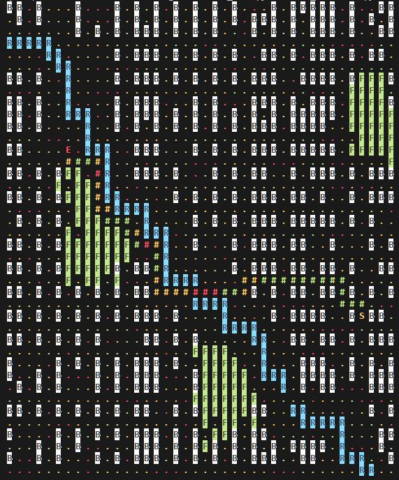

# Миниатюрный навигатор

## Новая версия

### Цель
Цель - выбрать такой подход к построению маршрута, который будет учитывать 
накопленные данные по дорожным участкам, например, данные о средней загруженности
участка в определенные часы, и строить маршруты исходя не только из обстановки
на дороги в момент запроса, но и с учетом того, что по мере движения транспорта
время идёт, дорожная ситуация меняется в сторону средней загруженности и возможно
это позволит выбрать изначально более оптимальный маршрут

### Пример наивной реализации
__с базовым алгоритмом А* и учетом только текущего состояния__

- S - Старт
- E - Финиш
- B - дома
- R - река
- F - лесной массив

Цвет участка зависит от текущей загруженности

## Старая версия 

### Описание

Генерирует "город" методом триангуляции Делоне и рандомную траспортную ситуацию,

строит кратчайшие маршруты между двумя точками методом Дейкстры, опционально отрисовывает

"город" и маршрут и обучает нейросеть предсказывать кратчайшие маршруты

### Порядок работы

**Установка:**

Linux: 

python -m venv venv

venv/bin/activate

pip install -t requirements.txt

start - navi_main

drawing - отрисовка города

learning - обучение нейросети

### Источники

фрагменты кода взяты из следующих источников:

Триангуляция Делоне  - "Алгоритмы неформально", Брэдфорд Такфилд

Нейросеть - "Грокаем глубокое обучение", Эндрю Траск; "Data science: наука о данных с нуля", Джоэл Грас

Метод Дейкстры - канал selfedu

