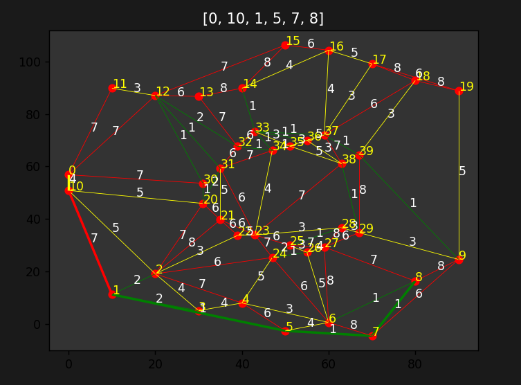

### Миниатюрный навигатор

## Описание

Генерирует "город" методом триангуляции Делоне и рандомную траспортную ситуацию,

строит кратчайшие маршруты между двумя точками методом Дейкстры, опционально отрисовывает

"город" и маршрут и обучает нейросеть предсказывать кратчайшие маршруты

## Порядок работы

start - navi_main

drawing - отрисовка города

learning - обучение нейросети

## Источники

фрагменты кода взяты из следующих источников:

Триангуляция Делоне  - "Алгоритмы неформально", Брэдфорд Такфилд

Нейросеть - "Грокаем глубокое обучение", Эндрю Траск; "Data science: наука о данных с нуля", Джоэл Грас

Метод Дейкстры - канал selfedu

